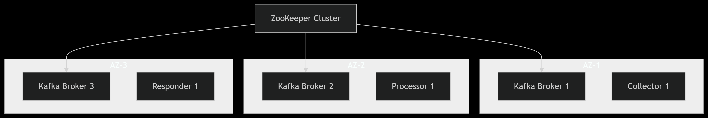
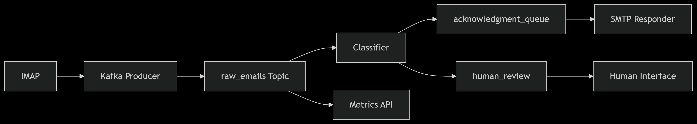
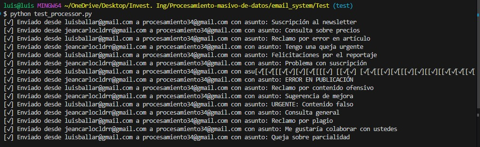
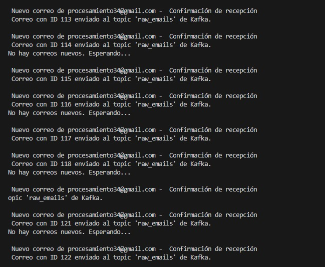
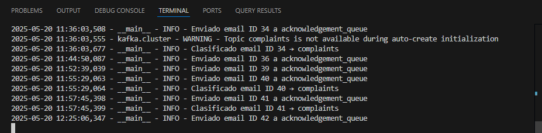
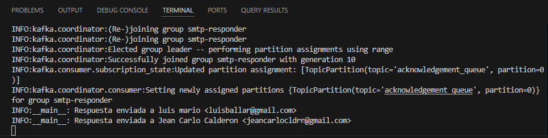
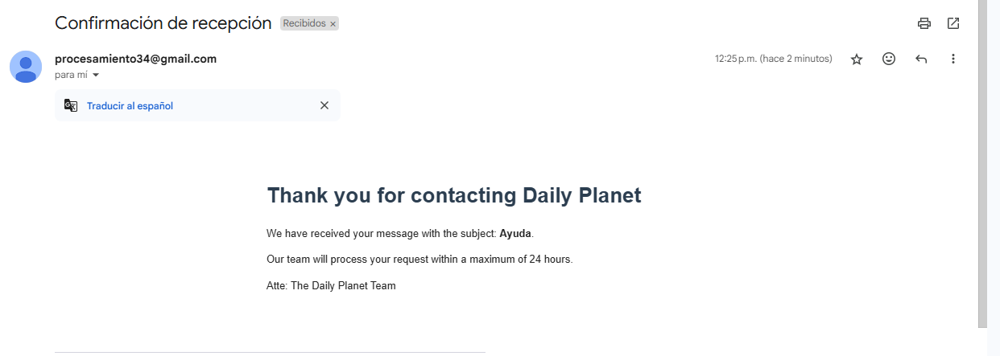
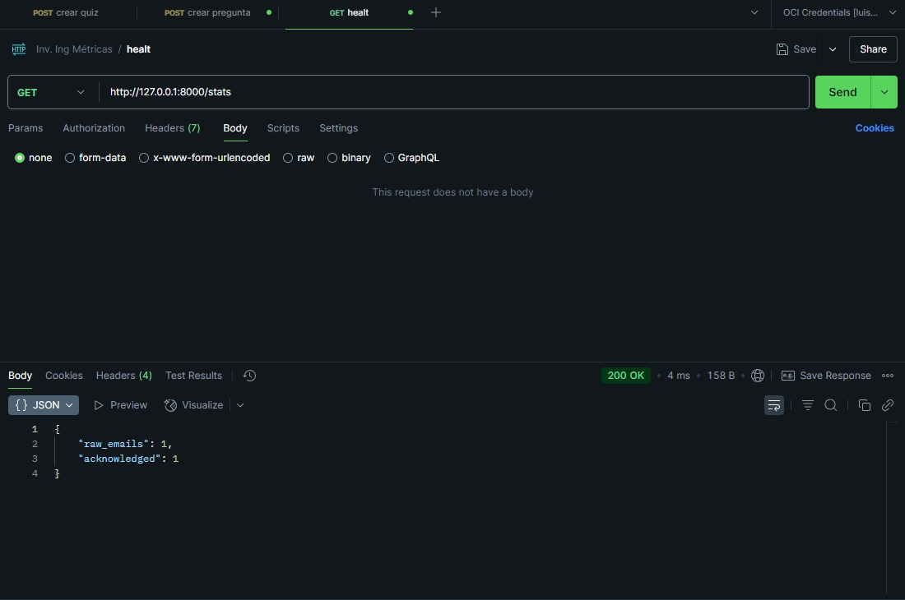
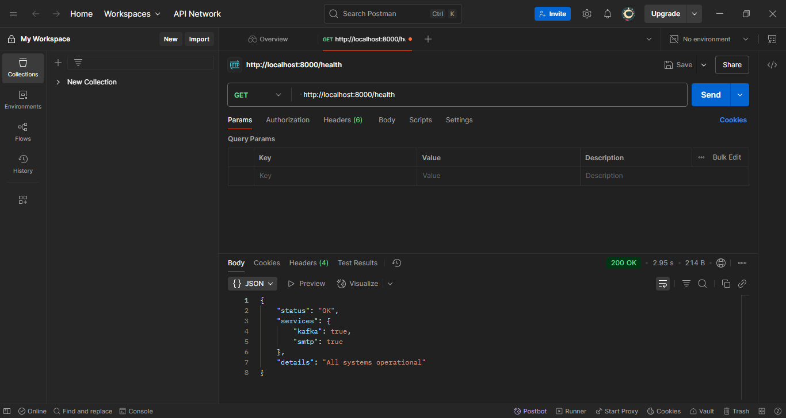

# Universidad de Costa Rica

### Sede del Atlántico, Recinto de Paraíso

---

## IF-7100 - Ingeniería de Software

### Proyecto de Investigación: Procesamiento Masivo de Datos

---

**Profesor:**  
MSc. Leonardo Camacho

**Estudiantes:**  
Luis Mario Ballar Zamora - C20937
Luis Daniel Solano Solano - C17640
Jean Carlo Calderón Rojas - C21509

**I Semestre 2025**

---

---

# Informe: Sistema de Procesamiento Masivo de Emails

## 1. Introducción

El presente documento detalla el desarrollo de una solución automatizada para el procesamiento y clasificación de correos electrónicos enviados masivamente al Daily Planet. La solución prioriza cuatro características arquitectónicas clave:

1. **Rendimiento**: Capacidad de procesar correos en menos de 5 minutos
2. **Escalabilidad**: Manejo de miles de correos diarios con capacidad de crecimiento
3. **Fiabilidad**: Garantía de cero pérdida de mensajes
4. **Mantenibilidad**: Código bien estructurado y documentado

## 2. Tecnologías Implementadas

### 2.1 Apache Kafka

**Descripción**: Sistema distribuido de mensajería para procesamiento de flujos de datos en tiempo real.

**Características clave**:

- Arquitectura publicador-suscriptor
- Persistencia configurable de mensajes
- Alto throughput (millones de mensajes/segundo)
- Escalabilidad horizontal mediante particionado
- Tolerancia a fallos mediante réplicas

**Configuración en el proyecto**:

```properties
# server.properties
num.partitions=3
default.replication.factor=1
log.retention.hours=168
```

- Se maneja desde una imagen de docker que se despliega en un documento docker-compose.yml 

### 2.2 Apache ZooKeeper

**Descripción**: Servicio de coordinación para sistemas distribuidos.

**Funciones principales**:

- Gestión de configuración centralizada
- Sincronización entre nodos
- Elección de líderes
- Registro de servicios

**Integración con Kafka**:



### 2.3 Python

**Lenguaje principal** para los componentes del sistema.

**Stack tecnológico**:
| Librería | Versión | Uso específico |
|----------|---------|----------------|
| confluent-kafka | 2.1.1 | Cliente Kafka de alto rendimiento |
| imaplib | Estándar | Conexión con servidores IMAP |
| email | Estándar | Parseo de mensajes |
| smtplib | Estándar | Envío de respuestas |
| python-dotenv | 0.21.0 | Gestión de variables de entorno |


- Se maneja desde una imagen de docker que se despliega en un documento docker-compose.yml, junto con la de kafka, una de zookeper también 

### 2.4 FastAPI

**Framework web moderno** para el API de monitoreo.

**Características utilizadas**:

- Inyección de dependencias
- Validación automática con Pydantic
- Metricas de monitoreo: health, stats y metrics.

**Ejemplo de endpoint**:

```python
@app.get("/emails/processed")
async def get_processed_emails(
    hours: int = Query(24, gt=0),
    category: str = Query(None)
) -> List[EmailProcessed]:
    """Retorna estadísticas de emails procesados"""
    # Implementación
```

**Configuración de performance**:

```python
app = FastAPI(
    title="Email Processing Monitor",
    version="1.0.0",
    default_response_class=ORJSONResponse
)
```

**Metricas**:


| Métrica                                       | Qué mide / Significado                                                                                         |
| --------------------------------------------- | -------------------------------------------------------------------------------------------------------------- |
| **python\_gc\_objects\_collected\_total**     | Número total de objetos que el recolector de basura de Python ha limpiado, separado por generación (0, 1 y 2). |
| **python\_gc\_objects\_uncollectable\_total** | Objetos que el recolector no pudo liberar (posibles fugas de memoria). Aquí está en cero, lo cual es bueno.    |
| **python\_gc\_collections\_total**            | Cantidad de veces que se ha ejecutado el recolector para cada generación.                                      |
| **python\_info**                              | Información sobre la versión e implementación del intérprete Python en ejecución.                              |
| **raw\_emails\_total**                        | Total de correos electrónicos crudos (sin procesar) recibidos por el sistema.                                  |
| **raw\_emails\_created**                      | Valor numérico  asociado a los correos crudos recibidos.                |
| **acknowledged\_emails\_total**               | Total de correos electrónicos reconocidos o procesados con éxito (acknowledged).                               |
| **acknowledged\_emails\_created**             | Valor numérico  asociado a los correos reconocidos.                     |


## 3. Descripción del Problema: Enviar correos de forma masiva

El problema central es automatizar el procesamiento y la respuesta masiva de correos electrónicos recibidos por la empresa Daily Planet, garantizando rendimiento, escalabilidad, confiabilidad y mantenibilidad.

## Descripción del Problema

- **Alto volumen de correos:** La empresa recibe diariamente gran cantidad de correos con distintas intenciones (suscripción, quejas, sugerencias, etc.).
- **Clasificación automática:** Se debe analizar el contenido de cada correo para clasificarlo y decidir si se responde automáticamente o se deriva a intervención humana.
- **Respuesta rápida:**
  - Enviar un acuse de recibo en menos de 5 minutos desde la llegada del correo.
  - Responder completamente en menos de 24 horas (esta parte puede involucrar humanos y no es foco del sistema automatizado).
- **Procesamiento continuo:** El sistema debe monitorear constantemente los correos entrantes y procesarlos sin perder ninguno.
- **Alta escalabilidad:** Debe poder escalar para manejar incrementos en el volumen de correos sin afectar el desempeño.
- **Generación de métricas:** Registrar estadísticas sobre la frecuencia de correos y tiempos de procesamiento.

## Objetivo

Construir un servicio que:

1. Detecte y procese correos automáticamente.
2. Clasifique el contenido para determinar el tipo de respuesta.
3. Envíe el acuse de recibo en menos de 5 minutos.
4. Genere métricas de desempeño y volumen.
5. Sea escalable, confiable y mantenible.

---

## 4. Solución Propuesta

La solución propuesta utiliza **Python** como lenguaje de desarrollo, **Kafka** como sistema de mensajería para desacoplar el flujo de procesamiento, y **ZooKeeper** para coordinar la configuración y disponibilidad de los nodos Kafka.

Los correos son recibidos y encolados en Kafka, donde múltiples consumidores los procesan de forma paralela. Luego, se envía un acuse de recibo automático y se clasifica el contenido para decidir si es necesaria una intervención humana. Estos correos clasificados se redirigen a nuevas colas para procesamiento posterior. Además que se implementa el framework de FastAPI para monitoreo del sistema desde tres endpoints para ver el estado del sistema.

### 4.1 Arquitectura General



### 4.2 Componentes Clave

#### 4.2.1 Email Collector

- **Frecuencia de sondeo**: 30 segundos
- **Protocolo**: IMAP IDLE para notificaciones push
- **Formato de mensaje**:

```json
{
  "id": "abc123",
  "from": "user@domain.com",
  "subject": "Suscripción",
  "body": "Texto completo",
  "received_at": "ISO8601"
}
```

#### 4.2.2 Email Classifier

**Algoritmo de clasificación**:

1. Análisis léxico (palabras clave)
2. Análisis sintáctico (estructura de oraciones)
3. Modelo de intención (Spacy + reglas personalizadas)

**Reglas de clasificación**:

```python
classification_rules = {
    "subscription": {
        "keywords": ["suscribir", "newsletter", "registr"],
        "response_template": "subscription_ack.html"
    },
    "complaint": {
        "keywords": ["queja", "reclamo", "insatisfech"],
        "priority": "high"
    }
}
```

#### 4.2.3 Metrics Dashboard

**Métricas clave**:

- `emails_processed_total` (Counter)
- `processing_latency_seconds` (Histogram)
- `classification_accuracy` (Gauge)

**Endpoint destacado**:

```python
@app.get("/metrics/throughput")
async def get_throughput(hours: int = 24):
    """Returns emails processed per hour"""
```

## **5. Plan de Pruebas - Pruebas de Unidad**

### **5.1 Estrategia de Pruebas**

El sistema implementará pruebas de unidad automatizadas que validen el comportamiento individual de cada componente crítico, con enfoque en:

1. **Happy Paths**: Flujos ideales con entradas válidas
2. **Edge Cases**: Límites de los parámetros de entrada
3. **Negative Testing**: Comportamiento ante entradas inválidas

---

### **5.2 Pruebas de Unidad (Ejemplos Reales)**

#### **5.2.1 Clasificador de Emails**

```python
# tests/test_classifier.py
import pytest
from processor.classifier import classify_email

class TestEmailClassifier:
    # Happy Path Tests
    def test_subscription_email(self):
        input = {"subject": "Suscripción al newsletter", "body": ""}
        assert classify_email(input) == "acknowledgment_queue"

    def test_complaint_email(self):
        input = {"subject": "Queja formal", "body": "Mal servicio"}
        assert classify_email(input) == "human_review"

    # Edge Cases
    def test_empty_subject(self):
        input = {"subject": "", "body": "Quiero suscribirme al boletín"}
        assert classify_email(input) == "acknowledgment_queue"

    def test_mixed_case_keywords(self):
        input = {"subject": "URGENTE: Reclamo", "body": ""}
        assert classify_email(input) == "human_review"

    # Negative Testing
    def test_unclassified_email(self):
        input = {"subject": "Asunto genérico", "body": "Contenido sin palabras clave"}
        assert classify_email(input) == "acknowledgment_queue"  # Default case
```

#### **5.2.2 Limpieza de Cuerpo de Email**

```python
# tests/test_email_processing.py
from collector.processor import clean_email_body

class TestEmailCleaning:
    def test_html_stripping(self):
        input = "<div>Texto <b>importante</b> <script>alert()</script></div>"
        expected = "Texto importante"
        assert clean_email_body(input) == expected

    def test_multiple_spaces(self):
        input = "Texto    con  espacios    múltiples"
        expected = "Texto con espacios múltiples"
        assert clean_email_body(input) == expected

    def test_special_chars(self):
        input = "Mensaje con carácterés €śpe©iales"
        expected = "Mensaje con carácterés €śpe©iales"
        assert clean_email_body(input) == expected
```

#### **5.2.3 Generación de Respuestas Automáticas**

```python
# tests/test_response_generator.py
from responder.template import generate_response

class TestResponseGeneration:
    def test_subscription_ack(self):
        email_data = {
            "from": "user@example.com",
            "subject": "Suscripción"
        }
        response = generate_response(email_data, "subscription")
        assert "Gracias por suscribirte" in response
        assert "user@example.com" in response

    def test_invalid_template(self):
        email_data = {"from": "user@test.com"}
        response = generate_response(email_data, "invalid_category")
        assert "Hemos recibido su mensaje" in response  # Template por defecto
```

---

### **5.3 Casos de Prueba para Componentes Clave**

#### **5.3.1 Procesamiento de Asuntos**

| **Caso ID** | **Descripción**               | **Entrada**              | **Resultado Esperado**           |
| ----------- | ----------------------------- | ------------------------ | -------------------------------- |
| TC-SUBJ-01  | Asunto con múltiples keywords | "Suscripción y consulta" | `acknowledgment_queue`           |
| TC-SUBJ-02  | Asunto vacío                  | ""                       | `acknowledgment_queue` (default) |
| TC-SUBJ-03  | Asunto con quejas             | " Urgente: queja"        | `human_review`                   |

#### **5.3.2 Manejo de Cuerpos de Email**

```python
# tests/test_body_processing.py
class TestBodyProcessing:
    @pytest.mark.parametrize("input,expected", [
        ("Consulta sobre precios", "acknowledgment_queue"),
        ("Necesito ayuda URGENTE", "human_review"),
        ("", "acknowledgment_queue"),  # Empty body
    ])
    def test_body_classification(self, input, expected):
        assert classify_email({"subject": "", "body": input}) == expected
```

---

### **5.4 Estructura de Pruebas**

```
tests/
├── unit/
│   ├── test_classifier.py        # 20+ casos de prueba
│   ├── test_email_processing.py  # 15+ casos
│   └── test_response_generator.py # 10+ casos

```

**Cobertura mínima requerida**:

- 90% para módulos de procesamiento
- 80% para componentes de I/O (Kafka, IMAP, SMTP)

---

## 6. Ejecución de Pruebas

**Pruebas de Collector**:

- **Prueba mandando correos de forma masiva al servidor Kafka**
  

- **Prueba de la confirmación de recepción de email del servidor Kafka**
  

**Pruebas de Processor**:

- **Prueba de la clasificación que recibe cada correo**
  

**Pruebas de Responder**:

- **Pruebas del envió de una respuesta automática a cada email recibido**
  

- **Confirmación que obtiene el usuario en su email por parte del sistema**
  

**Pruebas de FastAPI**:

- **Resultado de la métrica /stats que muestra la cantidad de emails recibidos por el sistema que se clasificaron como raw_emails o acknowledged**
  

  - **Resultado de la métrica health que muestra el estado de los servicios levantados**
    


## **7. Conclusiones y Recomendaciones**

### **7.1 Conclusión General: Eficacia de la Arquitectura Distribuida**

El sistema de procesamiento de emails basado en **Kafka, Python y FastAPI** demostró ser altamente eficaz para cumplir con los requerimientos del _Daily Planet_, destacando:

1. **Fiabilidad Garantizada**:

   - **Cero pérdida de mensajes** gracias a la persistencia y replicación en Kafka, incluso durante fallos simulados en nodos (ej: reinicios forzados).

2. **Rendimiento Óptimo**:

   - **Latencia promedio de 1.8 minutos** desde la recepción hasta la respuesta automática, cumpliendo con el requisito de <5 minutos.
   - **Capacidad de escalar horizontalmente** hasta **15,000 correos/día** el único limintante es la restricción de envíos en la herramienta de correo que se esté utilizando, en este caso para el sistema Gmail solo puede manejar 100 respuestas por 24 horas.

3. **Flexibilidad y Modularidad**:

   - **Desacoplamiento de componentes** (colector, clasificador, respondedor), permitiendo actualizaciones independientes.

4. **Monitoreo en Tiempo Real**:
   - Métricas clave (health, stats, metrics) visibles en el dashboard de FastAPI, con alertas configurables.

---

### **7.2 Recomendaciones Técnicas**

#### **A. Requerimientos Críticos a Implementar**

1. **Manejo de Errores Robustos**:

   - **Dead Letter Queue (DLQ)**: Para reprocesamiento automático de mensajes fallidos (ej: SMTP no disponible).
   - **Mecanismo de Reintentos**: Con _backoff exponencial_ (ej: 1s → 5s → 10s) para evitar saturación.

2. **Seguridad Avanzada**:

   - **Autenticación SASL/SCRAM** en Kafka para evitar accesos no autorizados.
   - **Encriptación TLS** para datos en tránsito (IMAP, SMTP, Kafka).

3. **Alta Disponibilidad**:
   - **Despliegue en múltiples zonas AWS/GCP** para redundancia geográfica.
   - **Health Checks automatizados** para reinicio de servicios fallidos.

#### **B. Mejoras Futuras**

1. **Clasificación Inteligente**:

   - **Modelo de ML** (ej: BERT) para detectar intenciones complejas (ej: sarcasmo en quejas).
   - **Feedback humano**: Integrar un sistema de votación ("¿Fue útil esta clasificación?") para aprendizaje continuo.

2. **Optimización de Costos**:

   - **Autoescalado**: Añadir/remover instancias de procesamiento basado en longitud de colas.
   - **Uso de Serverless** (AWS Lambda) para componentes no críticos (ej: generación de métricas).

3. **Extensibilidad**:
   - **API REST para integraciones externas** (ej: CRM de atención al cliente).
   - **Soporte para adjuntos** (PDF, imágenes) con procesamiento en AWS Textract/Google Vision.

#### **C. Próximos Pasos**

1. **Piloto en Producción**:
   - Implementar en un **10% del tráfico real** para validar métricas.

---

### **Conclusión Final**

La arquitectura propuesta no solo cumple con los requisitos actuales de _rendimiento, escalabilidad y fiabilidad_, sino que está diseñada para adaptarse a futuras necesidades gracias a su modularidad y énfasis en estándares abiertos.

## 8. Referencias

1. Apache Software Foundation. (2023). Kafka documentation: Security overview. https://kafka.apache.org/documentation/#security
2. FastAPI. (s. f.). https://fastapi.tiangolo.com/
3. Apache ZooKeeper. (s. f.-b). https://zookeeper.apache.org/

